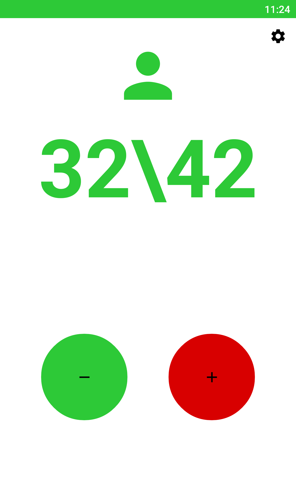
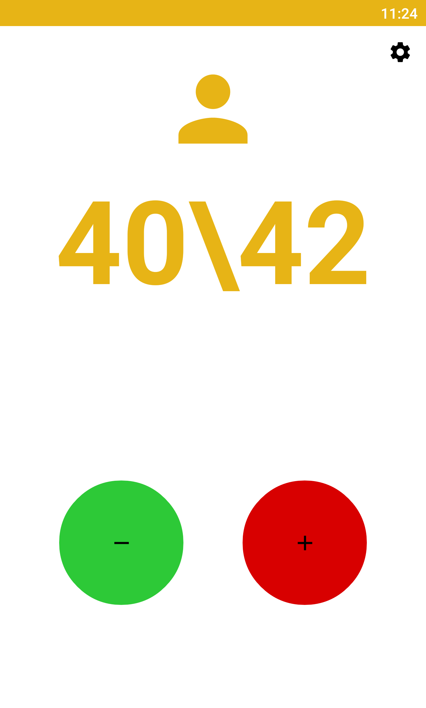
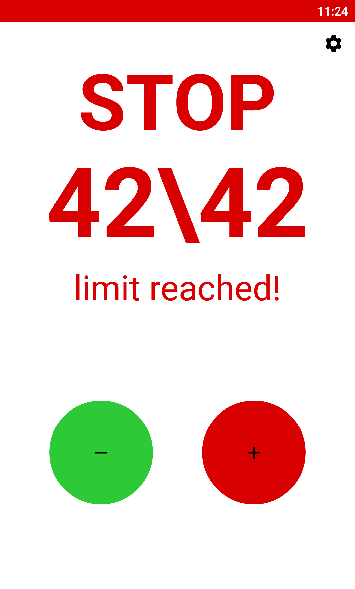

# customer-counter-android

Free and easy-to-use android application to count customers in your store(or anywhere you want).
Colorful warning when the counter is higher than 90% of the limit.
Obvious stop warning for reached limit.
Quickly change settings and value of the counter.
Use volume buttons to change the value of the counter, vibrate on change.

# why

Had some free time ... So I did a sub 12h project ...
It's not pretty or good but who cares :)

# screenshots

